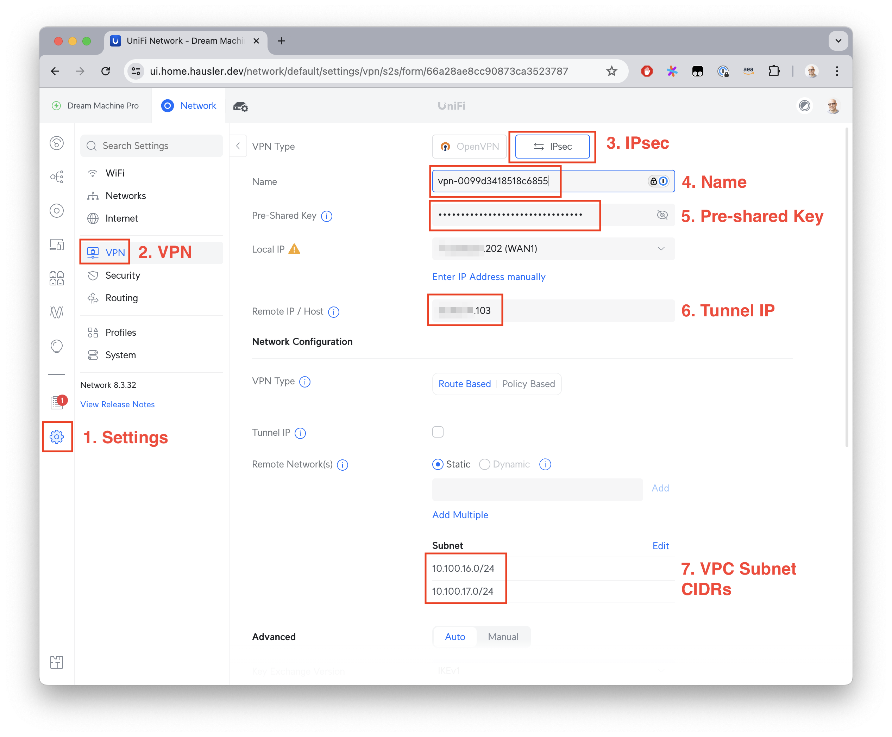

# AWS CDK to set up a site-to-site VPN from a VPC to your Unifi home network

This CDK configuration is automated from [Marcin Jasion's blog post](https://mjasion.pl/posts/cloud/how-to-setup-aws-site-to-site-vpn-with-unifi-udm/)
on connecting a unifi gateway to AWS.

## Prerequisites:
* Using Unifi Network (validated version 8.3)
* Identify your WAN IP (its ok if its dynamically assigned for demo purposes: you'll just have to update your VPN connection if it ever changes)
* Identify the CIDR(s) of the on-premise network(s) you want to have connectivity with the VPC, and ensure that they don't overlap with the VPC

## Setup
1. Run `./generate-stack-config.sh` and reply to the prompts for AccountID, Region, home IP, and VPC CIDR. Afterward, be sure to add the home network CIDR(s) that need VPC connectivity to `.onSiteCidrs` in the `stack-config.json` file. 
   1. If you don't want to create an EC2 instance, respond to the prompt with any value other than "true"
   2. While a VPC is free, a [site-to-site VPN has a per-hour cost and bandwidth costs][vpn-cost]. In most US regions, this is about $0.05/hr or ~$37/mo without any cloud egress.
2. Create the stack
    ```bash
    npm install
    cdk bootstrap
    # Optional diff to preview resources to be created
    cdk diff
    # Next command takes ~5 minutes
    cdk deploy
    ```
3. Get the connection information. Supply the stack output `VpnConnectionId` (starts with `vpn-`, a required input)
    ```bash
    # 9005b6c1 is the "generic" device type
    aws ec2 get-vpn-connection-device-sample-configuration \
        --vpn-connection-id $VPN_ID \
        --vpn-connection-device-type-id 9005b6c1 \
        --query "VpnConnectionDeviceSampleConfiguration" \
        --output text
    ```
    * You only need the details on the first connection tunnel. You're not going for high availability/redundancy here
4. Go to your Unifi configuration and add the IPSec VPN (Network/Settings/VPN/Site-to-Site VPN)
   * Enter a VPN name (I just used the `VpnConnectionId`)
   * In the "Pre-Shared Key" field, enter the pre-shared key from tunnel #1
   * In the "Remote IP/Host" field, enter the Virtual Private Gateway IP from tunnel #1 
   * In the "Remote Network(s)" field, add the VPC Subnet CIDRs
   * Leave all other settings untouched
   * Click "Add" at the bottom and wait a few minutes for the connection to initiate
  
1. Find the IP of the ASG instance, and curl it to get back Nginx's default page from the comfort of your own home!
    ```
    INSTANCE_IP=$(aws ec2 describe-instances --filters Name=tag:Name,Values=CDKVpn-demo/ASG --query "Reservations[0].Instances[0].PrivateIpAddress" --output text)
    curl http://$INSTANCE_IP:80
    ```
2. Enjoy success!
    ```
    $ curl http://$INSTANCE_IP:80
    <!DOCTYPE html>
    <html>
    <head>
    <title>Welcome to nginx!</title>
    <style>
    html { color-scheme: light dark; }
    body { width: 35em; margin: 0 auto;
    font-family: Tahoma, Verdana, Arial, sans-serif; }
    </style>
    </head>
    <body>
    <h1>Welcome to nginx!</h1>
    <p>If you see this page, the nginx web server is successfully installed and
    working. Further configuration is required.</p>

    <p>For online documentation and support please refer to
    <a href="http://nginx.org/">nginx.org</a>.<br/>
    Commercial support is available at
    <a href="http://nginx.com/">nginx.com</a>.</p>

    <p><em>Thank you for using nginx.</em></p>
    </body>
    </html>
    ```


[vpn-cost]: https://aws.amazon.com/vpn/pricing/

## Debugging

You can check the status of the tunnel you've connected your home network to by calling `ec2:DescribeVpnConnections` and inspecting the `VgwTelemetry` part of the response. The "UP" response will lag a little behind the true status. Your Unifi VPN status configuration page will show a true Up or Down status. 

```
aws ec2 describe-vpn-connections \
    --vpn-connection-ids $VPN_ID \
    --query "VpnConnections[0].VgwTelemetry"
```

